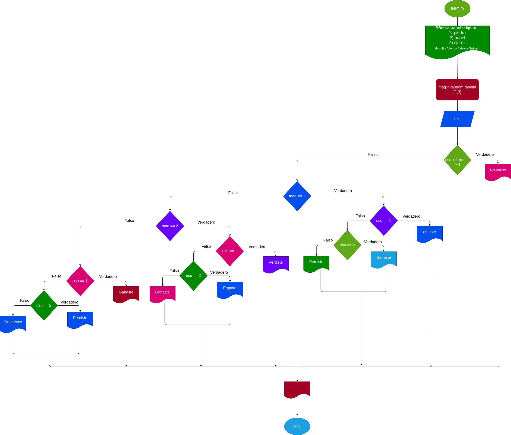

# Piedra_papel_tijeras
Un pequeño juego clásico que es piedra, papel o tijeras

# Analisis

## Input

### Variables de entrada
usu: elección realizada por el usuario

### prosesisng

usu: Determina la decisión del usuario.

Operaciones disponibles:

 1) Piedra 

 2) Papel

 3) Tijeras

 
Si usu no es válido, el resultado será "No válido".

### output
usu: Determina la decisión del usuario.

maq: Determina la decisión de la maquina.
# Diseño

 
# Construcción

